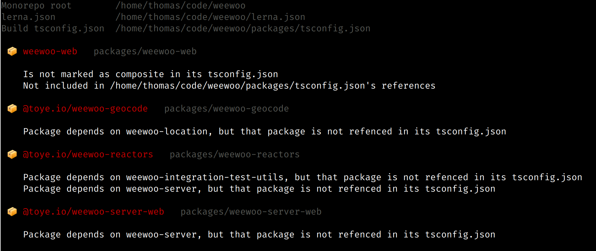

# ts-monocheck

Check if all references are correct in a Typescript/yarn/lerna monorepo.



## Usage

```bash
$ yarn add -WD ts-monocheck # In the root of your monorepo
$ yarn ts-monocheck
Monorepo root        /home/thomas/code/weewoo
lerna.json           /home/thomas/code/weewoo/lerna.json
Build tsconfig.json  /home/thomas/code/weewoo/packages/tsconfig.json

 📦 weewoo-web   packages/weewoo-web

    Is not marked as composite in its tsconfig.json
    Not included in /home/thomas/code/weewoo/packages/tsconfig.json's references

 📦 @toye.io/weewoo-geocode   packages/weewoo-geocode

    Package depends on weewoo-location, but that package is not referenced in its tsconfig.json

 📦 @toye.io/weewoo-reactors   packages/weewoo-reactors

    Package depends on weewoo-integration-test-utils, but that package is not referenced in its tsconfig.json
    Package depends on weewoo-server, but that package is not referenced in its tsconfig.json

 📦 @toye.io/weewoo-server-web   packages/weewoo-server-web

    Package depends on weewoo-server, but that package is not referenced in its tsconfig.json

```
